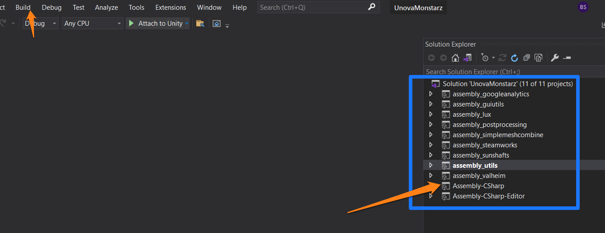
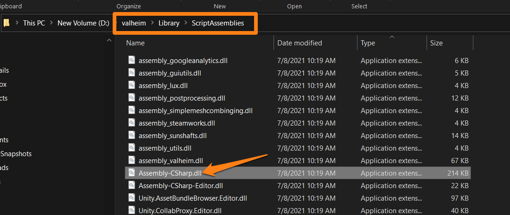

# Purpose
This POC is trying to answer the question. How do I get custom `MonoBehaviour`s out of Unity and into Valheim? 

## How to use custom monoscripts that have come with your assets. 

If you have purchased assets from the asset store more-than-likely you have gotten a small handful of custom .cs scripts that control certain aspects of your asset. When you try to use those prefabs with Valheim you are usually met with a sea of yellow text explaining how it cannot locate script portions. In the example today we will be working with particle systems respectively therefore the focus of this readme will be around that style of deployment. 

## First Steps

 1. Download your custom asset in Unity for my example I will be using one of my paid assets [Kripto MeshFX](https://assetstore.unity.com/packages/vfx/particles/spells/mesh-effects-67803)
 2.  Next head to your Project Settings in Unity we need to make sure we have a few things in the "Player" setup properly 
 3. The next thing you need to do is setup your prefab to use your custom monoscript component and bundle it.
 4. After you have your object created with this custom monoscript component attached. You need to compile the monoscripts into a usable format by your mod / valheim . You need to click the Assets dropdown tab. Then select
Open C# project. This will open up a visual studio project related to your Unity project. 

## Visual Studio

Visual studio should have opened automatically based on the last step. There COULD be some work to do here depending on how your scripts are written but there is a high chance you won't need to do much. 
Just press CTRL+B to build the project that has opened when finishing step 4 in the prior sequence. 

This will build all the *.dll files for your unity project. You will require one of these files in order to use your custom monoscripts with your mod. 

Now you have bult the Assembly-Csharp.dll that you require to make these custom monoscripts work with your mod. 

you can locate this file in UnityProjectFolder\Library\Scriptable Objects\Assembly-CSharp.dll

this shows the dll location in my project that is called valheim

## Logic Flow

## Usage in your mod

When you want to deploy this "repository.dll of custom mono-scripts" in your mod so you can have your cool prefabs do something with this mod. 

You will need to do just a few items in the project for your mod. 

First you need to add your "repository.dll" created earlier to your mod project as a file to be embedded

Once you have done that you will need to use a little code to stream this file on Awake() in order for the prefabs to be able to have their scripts find the supporting functions once they load into ObjectDB/Znet

		    Awake(){
		    Stream stream = Assembly.GetExecutingAssembly().GetManifestResourceStream("DefaultProjectNamespaceGoesHere.Assembly-CSharp.dll");

            byte[] buffer = new byte[stream.Length];

            stream.Read(buffer, 0, buffer.Length);

            Assembly assembly = Assembly.Load(buffer);
			}

