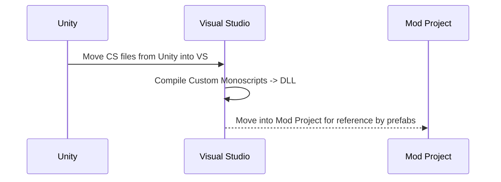

## How to use custom monoscripts that have come with your assets. 

If you have purchased assets from the asset store more-than-likely you have gotten a small handful of custom .cs scripts that control certain aspects of your asset. When you try to use those prefabs with Valheim you are usually met with a sea of yellow text explaining how it cannot locate script portions. In the example today we will be working with particle systems respectively therefore the focus of this readme will be around that style of deployment. 

## First Steps

 1. Download your custom asset in Unity for my example I will be using one of my paid assets [Kripto MeshFX](https://assetstore.unity.com/packages/vfx/particles/spells/mesh-effects-67803)
 2. Use the built in asset manager to import your assets into your Unity project 
 3. Once in your unity project take note of the "Scripts" that come with your assets see attached photo for reference 
			 
4. After you have the location of your scripts you will need to either 
		4a. Put them all into the same "Scripts Folder"
		4b. Create respective assembly definitions for each folder and tie back retrospectively to the parent folders
	For ease of explanation we will be going with method 4a 

5a. Now that you have all the scripts in a central location / folder. You need to create an Assembly Definition file for this folder in order to indicate to your prefabs that these scripts do exist in  an assembly. 
 
6a. At this point it is up to you to determine how to use your mono-script portions within unity. 

## Visual Studio

At this point you will want to move into visual studio, Assuming you have a solution started for your mod already with a respective project for this mod. Make a second project in your solution. Choose a .Net lib and use the same references you would when building a mod (Bepinex/unstripped libs/publicized libs etc).

If you have done this you should have a visual studio project ready to load with files

You need to go to the folder your Unity project is saved in. Find the Assets folder and find your scripts folder location. 

Import EVERY SINGLE one of your .cs files into your Visual Studio project and build this project. You should get a .dll 

This .dll will be used as your "in game repository of custom effects" 

## Logic Flow

And this will produce a flow chart:

